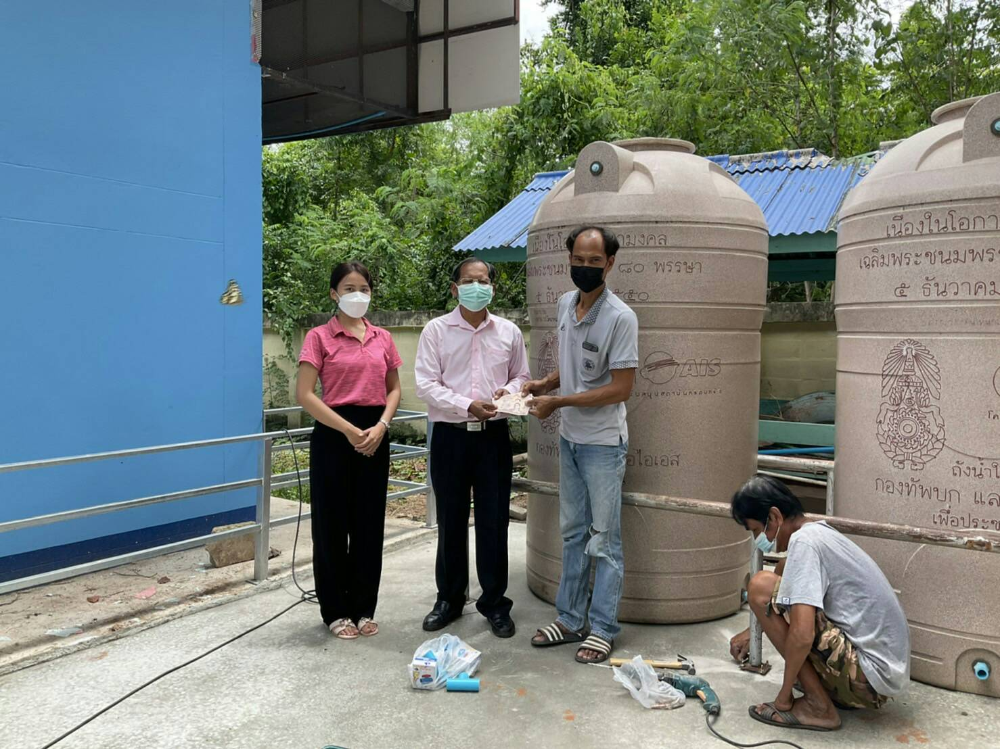
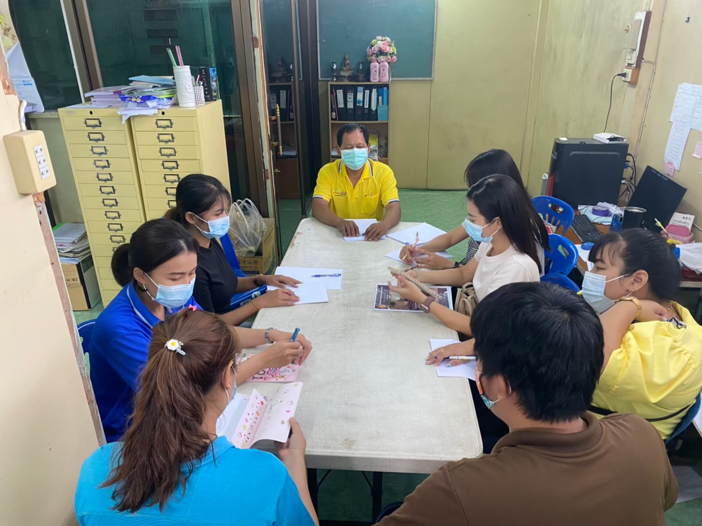
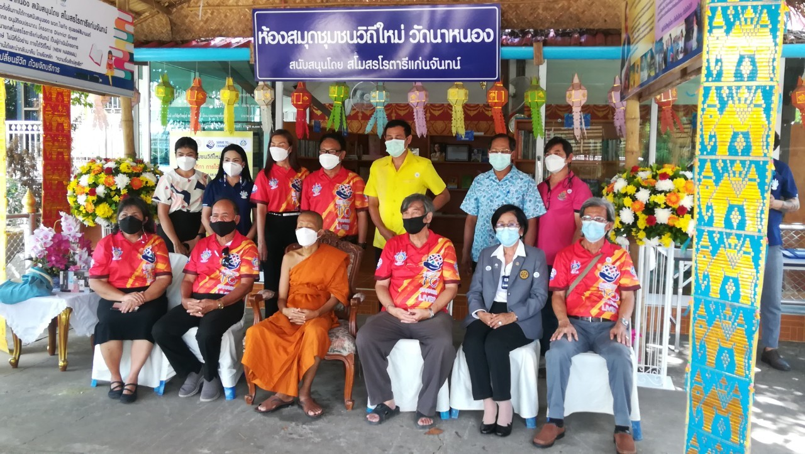

# การป้องกันการทุจริต

ตัวชี้วัดย่อยที่ 1 การดำเนินการเพื่อป้องกันการทุจริต ได้แก่ เจตจำนงสุจริตของผู้บริหาร การประเมินความเสี่ยงเพื่อการป้องกันการทุจริต การเสริมสร้างวัฒนธรรมองค์กร และแผนปฏิบัติการป้องกันการทุจริต

## เจตจำนงสุจริตของผู้บริหาร {#director-will}

### เจตจำนงสุจริตของผู้บริหาร {#o34}

โรงเรียนวัดนาหนอง(วิธานราษฎร์อนุกูล)ได้ศึกษาและบริหารงาน ซึ่งครอบคลุมด้านความโปร่งใส ด้านความพร้อมรับผิดด้านความปลอดจากการทุจริตในการปฏิบัติงานด้านวัฒนธรรมคุณธรรมในองค์กร ด้านคุณธรรมการทำงานในหน่วยงาน และด้านการสื่อสารภายในหน่วยงานและเชื่อมั่นว่าความประพฤติของข้าราชการและบุคลากรทุกคนในสังกัดจะต้องตอบสนองต่อความต้องการของสังคม เป็นที่เชื่อถือไว้วางใจของประชาชน และคาดหมายว่าข้าราชการทุกคนจะประพฤติตนอย่างสมเกียรติในขณะที่ปฏิบัติหน้าที่ตามความรับผิดชอบของตนเพื่อใช้เปรียบเทียบกับการปฏิบัติและการพิจารณาปรับปรุงพฤติกรรมตนเองให้เหมาะสม ข้าพเจ้า ขอแสดงเจตจำนงในฐานะผู้บริหารโรงเรียนวัดนาหนอง(วิธานราษฎร์อนุกูล)ที่พร้อมจะส่งเสริสนับสนุนให้ข้าราชการและบุคลากรในสังกัดทุกคน ปฏิบัติงานอย่างมีคุณธรรม ความโปร่งใสในการดำเนินงานอย่างมีประสิทธิภาพและประสิทธิผล พร้อมที่จะรักษาผลประโยชน์ของรัฐและมอบความเป็นธรรมแก่ประชาชน อย่างเสมอภาคและเท่าเทียม

ข้าพเจ้า ขอแสดงเจตจำนงต่อเพื่อนข้าราชการทุกคนว่า ข้าพเจ้าจะปฏิบัติหน้าที่ด้านการบริหารในการป้องกันและปราบปรามการทุจริตในภาครัฐ ด้วยสำนึกและตระหนักในความรับผิดชอบที่มีอยู่จะตั้งใจปฏิบัติหน้าที่โดยเต็มสติปัญญาความสามารถด้วยความสุจริตเที่ยงตรงและด้วยความมีสติยั้งคิด รู้ว่าสิ่งใดถูก สิ่งใดผิด สิ่งใดควรกระทำ สิ่งใดควรงดเว้น เพื่อให้งานที่ทำปราศจากโทษเสียหาย และบังเกิดประโยชน์สูงสุด โดยยึดหลักธรรมาภิบาลในการบริหารงานและจะยืนหยัดต่อต้านการทุจริตทุกรูปแบบทั้งนี้เพื่อประโยชน์สูงสุดของประชาชน โดยดำเนินการดังนี้

1. ปฏิบัติงานทุกขั้นตอนตามกฎหมาย ระเบียบ และข้อบังคับอย่างครบถ้วน เคร่งครัด ตลอดจนส่งเสริมให้บุคลากรปฏิบัติงานตามกฎหมาย ระเบียบ และข้อบังคับที่กำหนด
2. ปลูกฝังและสร้างความตระหนักรู้ ค่านิยมในการต่อต้านการทุจริตคอร์รัปชั่น รู้จักแยกแยะประโยชน์ส่วนตนกับประโยชน์ส่วนรวมเพื่อปลูกฝังจิตสำนึกในด้านคุณธรรมและป้องกันการทุจริตคอร์รัปชั่นในหน่วยงาน
3. ไม่ยอมรับพฤติกรรมการทุจริตคอร์รัปชั่น และไม่ทนต่อการทุจริตที่ก่อให้เกิดการลงโทษทางสังคม อันจะส่งผลให้บุคลากรในโรงเรียนวัดนาหนอง(วิธานราษฎร์อนุกูล เกิดความละอายหรือความกลัวที่จะกระทำการทุจริตคอร์รัปชั่น
4. ปลูกฝังจิตสำนึกให้ผู้เรียนของสถานศึกษาสังกัด ตระหนักถึงผลร้ายและต่อต้านการทุจริตคอร์รัปชั่น
5. แนวทางการดำเนินการและกิจกรรมความร่วมมือ
   5.1 ประสานงานและให้ความร่วมมือในการดำเนินงานขับเคลื่อนยุทธศาสตร์ชาติว่าด้วยการป้องกันและปราบปรามการทุจริต ระยะที่ ๓ (พ.ศ. ๒๕๖๐ – ๒๕๖๔)
   5.2 ประสานความร่วมมือเข้าร่วมเป็นเครือข่ายป้องกันและปราบปรามการทุจริตกับสำนักงานคณะกรรมการการศึกษาขั้นพื้นฐานสำนักงานเขตพื้นที่การศึกษาและสถานศึกษาในสังกัด
   5.3 ร่วมจัดให้ความรู้เกี่ยวกับแนวทางการส่งเสริมด้านคุณธรรม จริยธรรม แก่ผู้บริหารและบุคลากรทางการศึกษาในสังกัด เพื่อการมีส่วนร่วมในการเผยแพร่รณรงค์ต่อต้านการทุจริต และเป็นเครือข่ายป้องกันและปราบปรามการทุจริต
   5.4 ร่วมกันจัดทำช่องทางการสื่อสาร เผยแพร่ และประชาสัมพันธ์ เพื่อสนับสนุนการดำเนินงานในฐานะเครือข่ายความร่วมมือป้องกันและปราบปรามการทุจริต
   5.5 ให้คำปรึกษา เสนอแนะแนวทาง รวมถึงการติดตามและประเมินผลการดำเนินงานความร่วมมือดังกล่าว
   5.6 ร่วมดำเนินการอื่นใดในด้านการป้องกันและปราบปรามการทุจริตทุกรูปแบบอย่างเต็มก ําลังความสามารถ

ข้าพเจ้าขอยืนยันว่าโรงเรียนวัดนาหนอง(วิธานราษฎร์อนุกูล)จะยึดมั่นในการเป็นส่วนราชการที่มีความโปร่งใสและพร้อมตรวจสอบได้ ให้สมกับวิสัยทัศน์ของสำนักงานคณะกรรมการการศึกษาขั้นพื้นฐานที่ว่า "การศึกษาขั้นพื้นฐานของประเทศไทยมีคุณภาพและมาตรฐานระดับสากล บนพื้นฐานของความเป็นไทย"

ลงชื่อ นายธีระชัย ประพันธ์พจน์ ผู้อำนวยการโรงเรียนวัดนาหนอง (วิธานราษฎร์อนุกูล)

### การมีส่วนร่วมของผู้บริหาร {#o35}

ผู้บริหารสูงสุดของโรงเรียน ได้เข้าร่วมกิจกรรมและแสดงเจตนารมณ์อย่างสูงสำหรับการพัฒนาหน่วยงาน ตลอดจนกิจการรอบ ๆ พื้นที่ทั้งทางภาครัฐและเอกชน

ผู้อำนวยร่วมพัฒนาโรงเรียน (อาคารอนุบาล)

การประชุมเพื่อหารือเกี่ยวกับการเรียนการสอนยุคโควิด19

ผู้บริหารร่วมเป็นคณะกรรมการเปิดห้องสมุดชุมชน ณ วัดนาหนอง

## การประเมินความเสี่ยงเพื่อการป้องกันการทุจริต {#risk-assessment}

### การประเมินความเสี่ยงการทุจริตประจำปี {#o36}

คุณสามารถดาวน์โหลด [การประเมินความเสี่ยงการทุจริตประจำปีได้ที่นี่](files/o36-risk-assessment.pdf) [PDF]

### การดำเนินการเพื่อจัดการความเสี่ยงการทุจริต {#o37}

คุณสามารถดาวน์โหลด [การดำเนินการเพื่อจัดการความเสี่ยงการทุจริตได้ที่นี่](files/o37-risk-apply.pdf) [PDF]

## การเสริมสร้างวัฒนธรรมองค์กร {#company-culture}

### การเสริมสร้างวัฒนธรรมองค์กร {#o38}

คุณสามารถดาวน์โหลด [รายงานการเสริมสร้างวัฒนธรรมองค์กรได้ที่นี่](files/o38-corporate-cultural.pdf) [PDF]

## แผนปฏิบัติการป้องกันการทุจริต {#anticorruption-plan}

### แผนปฏิบัติการป้องกันการทุจริต {#o39}

คุณสามารถดาวน์โหลด [แผนปฏิบัติการป้องกันการทุจริตได้ที่นี่](files/o39-corruption-plan.pdf) [PDF]

### รายงานกำกับติดตามการดำเนินการป้องกันการทุจริตประจำปี รอบ 6 เดือน {#o40}

คุณสามารถดาวน์โหลด [รายงานกำกับติดตามการดำเนินการป้องกันการทุจริตประจำปีรอบครึ่งเดือนได้ที่นี่](files/o40-report-corruption-midyear.pdf) [PDF]

### รายงานผลการดำเนินการป้องกันการทุจริตประจำปี {#o41}

คุณสามารถดาวน์โหลด [รายงานผลการดำเนินการป้องกันการทุจริตประจำปีได้ที่นี่](files/o41-report-corruption-plan.pdf) [PDF]
