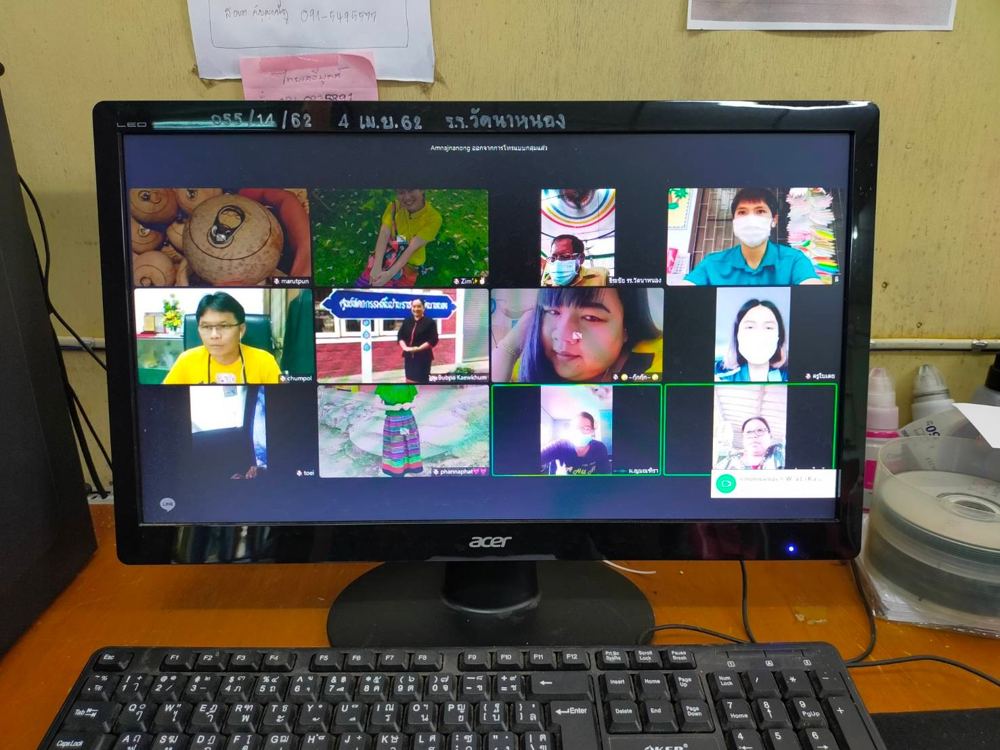
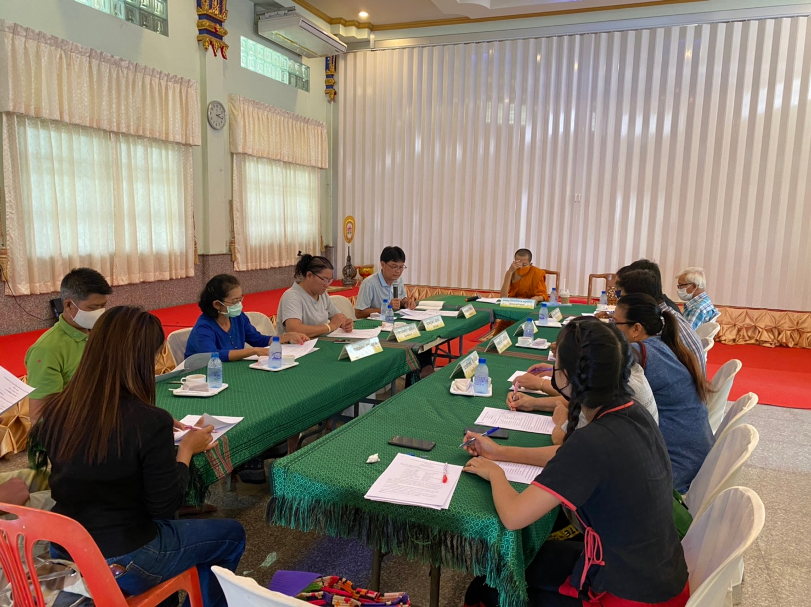

# การส่งเสริมความโปร่งใส

ตัวชี้วัดย่อยที่ 5 การส่งเสริมความโปร่งใส ได้แก่ การจัดการเรื่องร้องเรียนการทุจริตและประพฤติมิชอบ และการเปิดโอกาสให้เกิดการมีส่วนร่วม

## การจัดการเรื่องร้องเรียนการทุจริตและประพฤติมิชอบ {#complaint-misconduct}

### แนวปฏิบัติการจัดการเรื่องร้องเรียนการทุจริตและประพฤติมิชอบ {#o29}

โรงเรียนวัดนาหนองให้ความสำคัญกับเรื่องมาตรการการป้องกันการทุจริตและประพฤติมิชอบ เพื่อความโปร่งใสและตรวจสอบได้ ทางหน่วยงานได้มีจัดทำคู่มือ หลักเกณฑ์ หรือแผนปฏิบัติในการจัดการเรื่องร้องเรียนการทุจริตฯ ดังนี้

**หลักเกณฑ์และรายละเอียดในการร้องเรียน**

1. หลักเกณฑ์การร้องเรียน

   - เรื่องที่จะนำมาร้องเรียนต้องเป็นเรื่องที่ผู้ร้องเรียนได้รับความเดือดร้อน เสียหาย อันเนื่องมาจากเจ้าหน้าที่
   - เรื่องที่ร้องเรียนต้องเป็นเรื่องจริงที่มีมูล มิใช่ลักษณะกระแสข่าวที่สร้างความเสียหายแก่บุคคลที่ขาดหลักฐานแวดล้อม

2. ข้อร้องเรียนให้ใช้ถ้อยคำสุภาพ โดยระบุข้อมูล

   - ชื่อและที่อยู่ของผู้ร้องเรียน พร้อมหมายเลขโทรศัพท์หรืออีเมลติดต่อกลับ
   - การกระทำทั้งหลายที่เป็นเหตุแห่งการร้องเรียน พร้อมทั้งข้อเท็จจริง พฤติการณ์
   - คำขอของผู้ร้องเรียน
   - ลายมือชื่อผู้ร้องเรียน
   - วัน เดือน ปี ที่ร้องเรียน
   - ระบุพยานเอกสาร พยานวัตถุ หรือพยานบุคคล (ถ้ามี)

3. กรณีมีการร้องเรียนที่มีลักษณะเป็นบัตรสนเท่ห์ จะรับพิจารณาเฉพาะรายที่ระบุ หลักฐาน กรณีแวดล้อมปรากฎชัดแจ้ง
4. เรื่องร้องเรียนที่อาจไม่เข้าข่ายพิจารณา
   - ข้อร้องเรียนที่มิได้ทำเป็นหนังสือ
   - ข้อร้องเรียนที่ไม่ระบุพยาน หรือหลักฐานไม่เพียงพอ
   - ข้อร้องเรียนที่ไม่มีรายการตามที่ระบุ

**กระบวนการพิจารณา**

1. เมื่อได้รับเรื่องร้องเรียน ทางโรงเรียนฯจะรวบรวมข้อมูลเสนอผู้บังคับบัญชาตามลำดับ
2. หากข้อร้องเรียนนั้นไม่สมบูรณ์ครบถ้วน ทางโรงเรียนฯจะแนะนำให้ผู้ร้องเรียนแก้ไขภายในระยะเวลาที่กำหนด
3. บังคับบัญชาเห็นสมควรแต่งตั้งคณะกรรมการสอบสวนข้อเท็จ คณะกรรมการฯจะสอบสวน รวมไปถึงรวบรวมข้อเท็จจริง พร้อมทั้งเสนอความเห็นต่อผู้บังคับบัญชา
4. การไต่ส่วนมีการดำเนินการอย่างลับ และเปิดโอกาสให้ผู้ที่ถูกกล่าวหาได้พิสูจน์อย่างเป็นธรรม
5. คณะกรรมการฯรายงานผลการสอบสวนต่อผู้บังคับบัญชาภายในระยะเวลา 45 วันนับตั้งแต่วันที่ได้รับเรื่องร้องเรียน
6. ผู้อำนวยการแจ้งผลการร้องเรียนให้ผู้ร้องเรียนทราบ
7. หากข้อร้องเรียนเป็นเรื่องที่อยู่นอกเหนืออำนาจการพิจารณาของโรงเรียน ฯ ทางโรงเรียนฯจะส่งเรื่องร้องเรื่อนไปยังหน่วยงานที่เกี่ยวข้องโดยตรง

### ช่องทางแจ้งเรื่องร้องเรียนการทุจิตและประพฤติมิชอบ {#o30}

ทางโรงเรียนวัดนาหนอง มีช่องทางการแจ้งเรื่องร้องเรียนการทุจริตและประพฤติมิชอบ ผ่านทาง [กล่องข้อความโรงเรียนวัดนาหนอง](https://www.fb.com/messages/t/102432438057537)

### ข้อมูลเชิงสถิติเรื่องร้องเรียนการทุจริตและประพฤติมิชอบ {#o31}

ข้อมูลเชิงสถิติเรื่องร้องเรียนการทุจริตและประพฤติมิชอบ

| ประจำเดือน      | การรับสินบน | ผลประโยชน์ทับซ้อน | การจัดซื้อจัดจ้าง | อื่น ๆ | จำนวนเรื่องร้องเรียน |
| --------------- | ----------- | ----------------- | ----------------- | ------ | -------------------- |
| กรกฎาคม 2563    | -           | -                 | -                 | -      | 0                    |
| สิงหาคม 2563    | -           | -                 | -                 | -      | 0                    |
| กันยายน 2563    | -           | -                 | -                 | -      | 0                    |
| พฤศจิกายน 2563  | -           | -                 | -                 | -      | 0                    |
| ธันวาคม 2563    | -           | -                 | -                 | -      | 0                    |
| มกราคม 2564     | -           | -                 | -                 | -      | 0                    |
| กุมภาพันธ์ 2564 | -           | -                 | -                 | -      | 0                    |
| มีนาคม 2564     | -           | -                 | -                 | -      | 0                    |
| รวมทั้งสิ้น     | -           | -                 | -                 | -      | 0                    |

โรงเรียนวัดนาหหนอง ไม่มีเรื่องร้องเรียนการทุจริต เช่น การรับสินบน ผลประโยชน์ทับซ็อน การจัดซื้อจัดจ้าง เนื่องจากทางโรงเรียนวัดนาหนอง ได้กำชับบุคลากรในสังกัดห้ามกระทำความผิดอย่างเคร่งครัด

## การเปิดโอกาสให้เกิดการมีส่วนร่วม {#participation-opportunity}

### ช่องทางการรับฟังความคิดเห็น {#o32}

ทางโรงเรียนวัดนาหนอง ได้เปิดโอกาสให้แสดงความคิดเห็นของประชาชนทั่วไป ผ่านทาง [กล่องข้อความโรงเรียนวัดนาหนอง](https://www.fb.com/messages/t/102432438057537)

### การเปิดโอกาสให้เกิดการมีส่วนร่วม {#o33}

ทางโรงเรียนวัดนาหนอง นำโดยคณะครูและบุคลากร ได้มีเปิดโอกาสให้ผู้มีส่วนร่วมหรือส่วนเสียได้มีส่วนร่วมกับผู้ปกครอง คณะกรรมการสถานศึกษา หรือบุคคลภายนอก ผ่านทางเทคโนโลยี นำโดยแอปพลิเคชั่นไลน์และเฟซบุ๊ก ได้ร่วมกันปรึกษาหารือ เกี่ยวกับกิจการของโรงเรียนและนักเรียน

